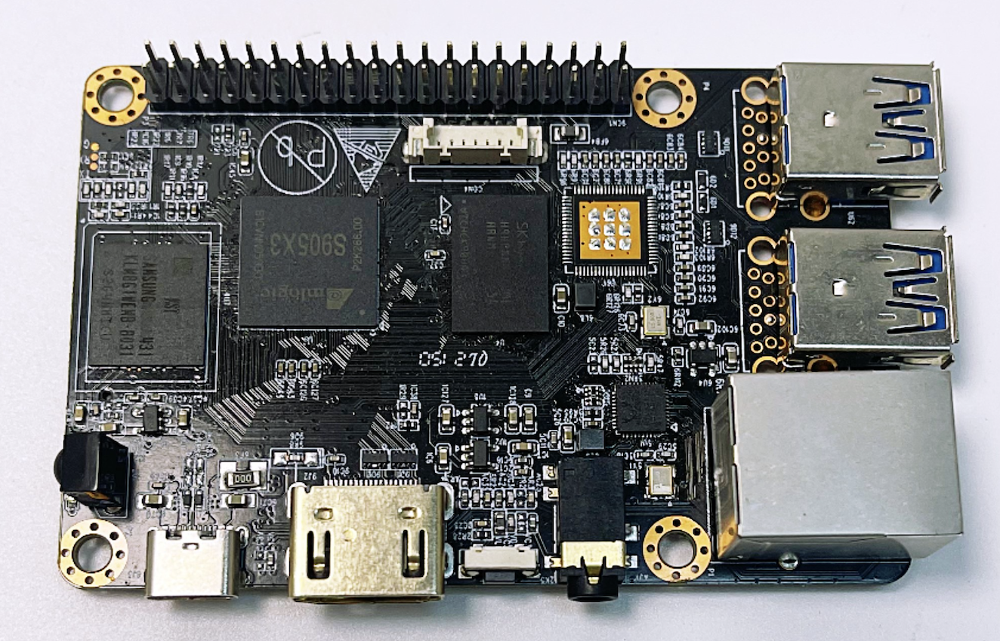

# Durian Pi HYY-D1 
The Durian Pi HYY-D1 is a single board computer designed by HYY company based on the Amlogic S905X3 chip. It adopts a 12nm process, four 64 bit ARM A55 architecture CPUs, integrates G31 GPU, supports 8K encoding and decoding, and supports multiple systems such as Linux and Android. The specifications and performance of HYY-D1 can be completely comparable to Odroid C4 and Raspberry PI 4. In the current global shortage of Raspberry PI, BPI-M5 is a very good substitute. Moreover, the supply of HYY-D1 is relatively stable, which is an advantage for the project.
- [ Durian Pi Hyy-D1.pdf](./Durian-Pi-D1/Durian-Pi-Hyy-D1.pdf.pdf?raw=true)

# Contacts
- Website: www.we-signage.com
- https://we-signage.en.made-in-china.com/
- E-mail: hejiangyan@hotmail.com
- Whatsapp/Wechat: + 86 18672559094
- Skype: hejiangyan_1